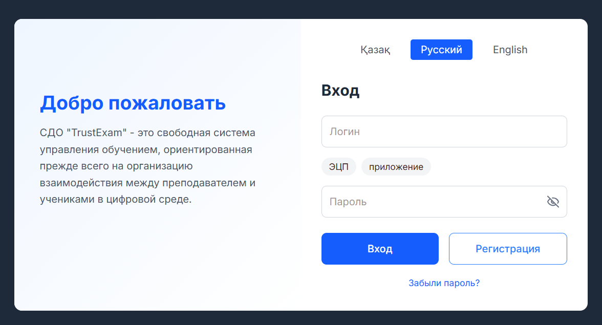
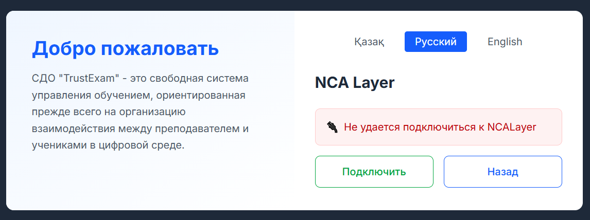
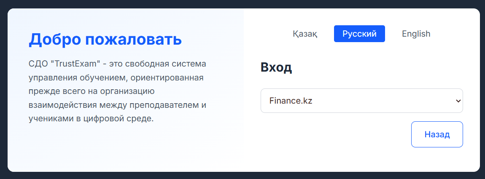
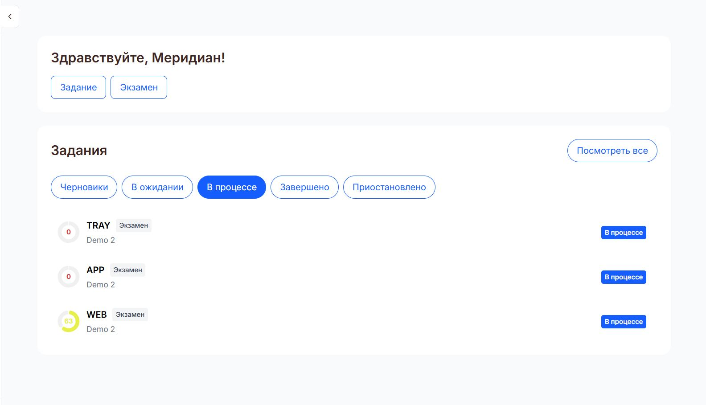

# Быстрый старт

Добро пожаловать на TrustExam! Это руководство поможет вам быстро начать работу.

## 1. Вход в систему

### Авторизация

Вы можете войти в систему несколькими способами:

**Логин и пароль**

- Введите email и пароль, которые вы получили при регистрации
- Нажмите "Войти"

---

**Электронная цифровая подпись (ЭЦП)**

- Выберите способ входа через ЭЦП
- Подпишите запрос вашей электронной подписью

---

**Приложение**

- Выберите отдельную организацию для авторизации

---

### Регистрация

Если у вас еще нет аккаунта:

1. Нажмите "Регистрация"
2. Заполните обязательные поля
3. Подтвердите email через ссылку в письме
4. Войдите в систему

## 2. Главный экран

После успешного входа вы попадете на главный экран, где можете:

### Быстрое создание

- **Создать задание** - переход к форме создания нового экзамена
- **Создать тест** - переход к созданию тестового материала

### Список заданий

На главном экране отображаются все ваши задания с возможностью:

- **Просмотра списка** всех назначенных тестирований
- **Сортировки по статусу**:
  - Черновики
  - Ожидающие начала
  - Активные
  - Завершенные
  - Приостановленные
- **Поиска** по названию задания
- **Быстрого доступа** к мониторингу и настройкам

## 3. Следующие шаги

Рекомендуем пройти эти этапы для полной настройки системы:

1. **[Создайте первый тест](managers/create-quiz.md)** - научитесь создавать тесты с разными типами вопросов
2. **[Настройте группу студентов](managers/manage-classes.md)** - создайте группу и добавьте студентов
3. **[Создайте и назначьте задание](managers/create-assignments.md)** - объедините тест и группу в экзамен

## 4. Нужна помощь?

- Ознакомьтесь с [руководством менеджера](managers/index.md) для полного обзора возможностей
- Посетите [раздел часто задаваемых вопросов](faq.md) для решения распространенных проблем
- Обратитесь в техническую поддержку при возникновении сложностей

---

**Совет**: Начните с создания простого теста и назначьте его небольшой группе, чтобы ознакомиться с основными функциями системы.
