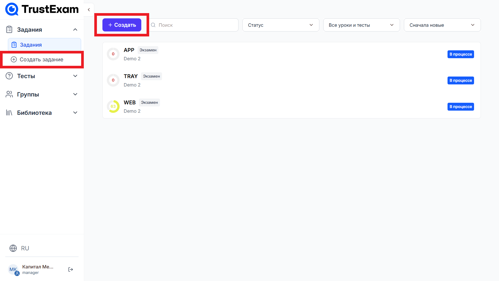
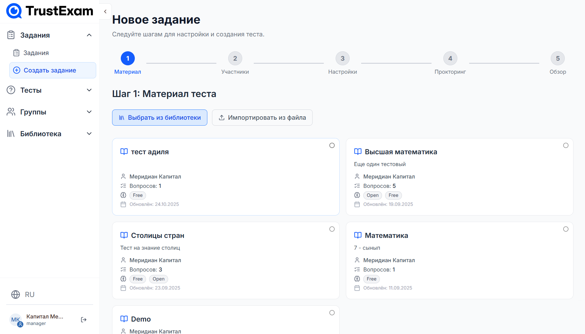
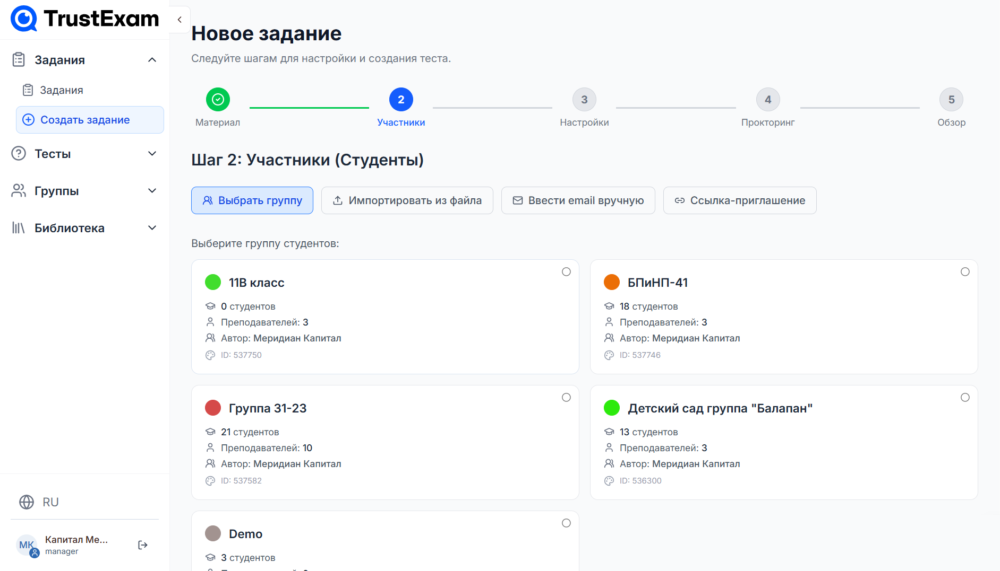
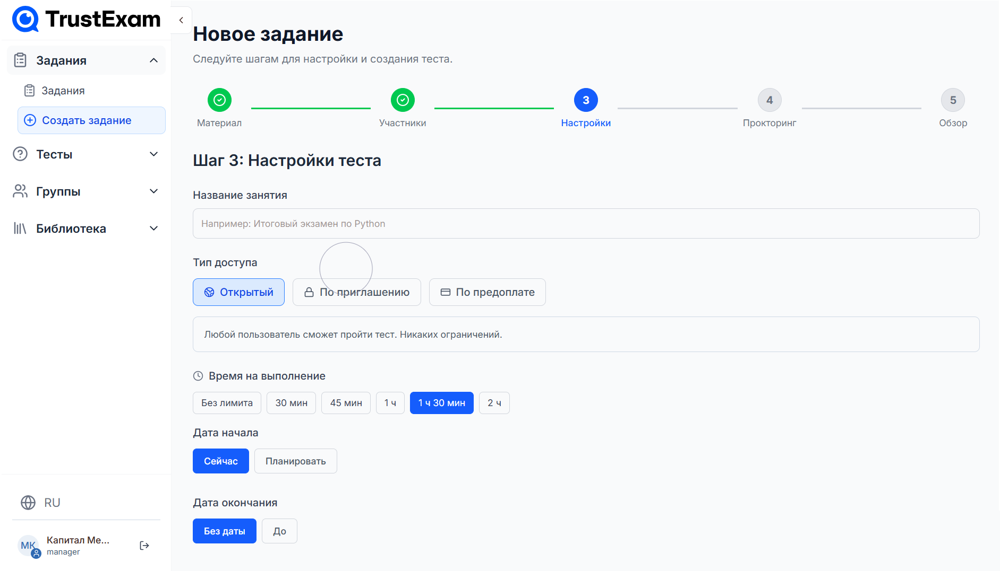
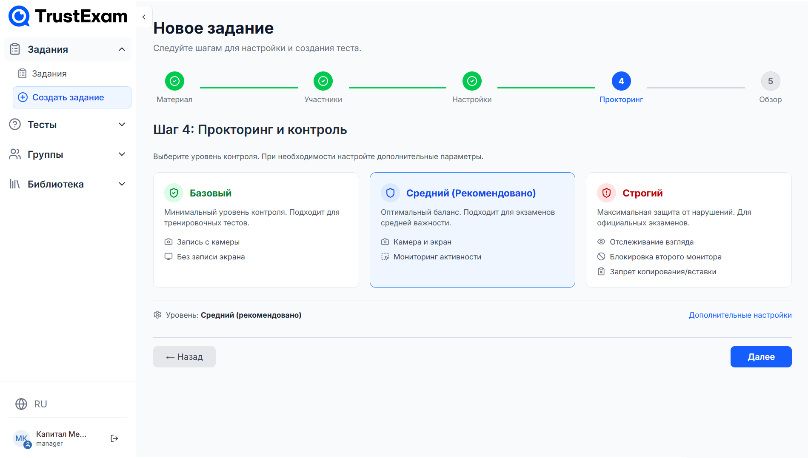
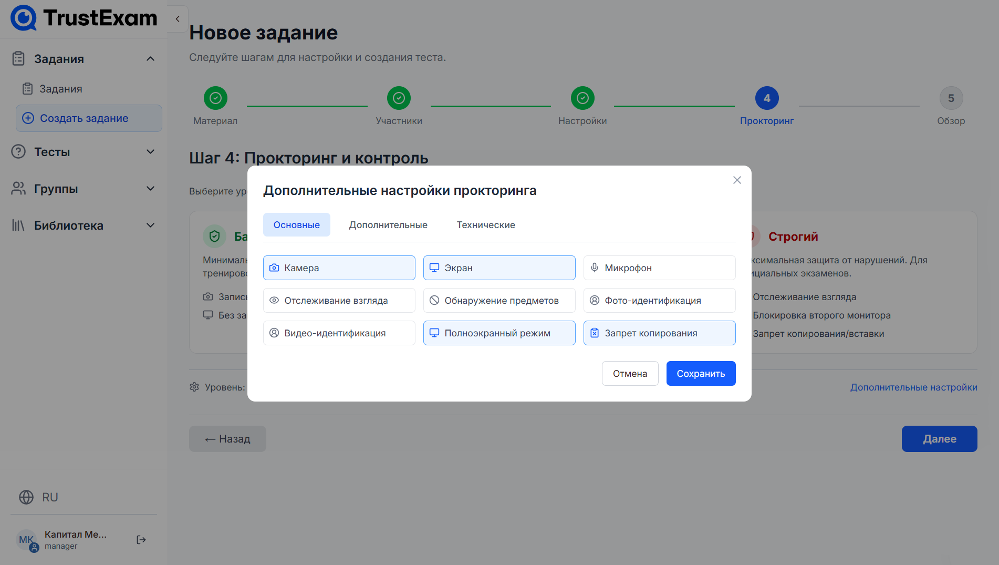

# Создание и настройка заданий (Assignments)

Задание (Assignment) — это назначение созданного вами теста (Quiz) определенной группе студентов с конкретными настройками времени, доступа и прокторинга.

## Процесс создания

В левом боковом меню в разделе "Задания" нажмите кнопку "Создать задание" либо перейдите на страницу "Задания" и нажмите кнопку "Создать".

## 1.  **Материал теста**

В первом шаге отображается список доступных Вам материалов, которые необходимо выбрать для назначения. Так же Вы можете импортировать материал из файла .docx, .xlsx, .csv.

## 2.  **Участники (Студенты)**

Далее Вам требуется выбрать студентов, которым Вы хотите назначить данное задание. Всего доступно 4 варианта добавления участников:

- **Выбрать группу из библиотеки** - Можно посмотреть полный список на странице "Мои группы" либо **[Создать новую](manage-classes.md)**.
- **Импортировать из файла** путем загрузки .xlsx либо .csv.
- **Ввод email вручную** - Введите email студентов через запятую.
- **Ссылка-приглашение** - генерация пригласительной ссылки.

## 3.  **Настройки теста:**

- **Название** - название теста, которое будет отображено у студентов.

- **Тип доступа:**
  - **Открытый:** Доступно по ссылке всем, у кого есть ссылка.
  - **По приглашению:** Доступно только выбранным студентам.
  - **Платный:** Доступно после оплаты.

- **Время на выполнение** - задайте время, за которое студент должен выполнить задание.
- **Дата и время начала задания** - задайте дату и время когда задание станет доступно.
- **Дата и время окончания задания** - задайте дату и время когда задание завершится.

## 4.  **Прокторинг и контроль:**

На этом этапе вы выбираете уровень контроля за участниками во время выполнения задания. Система предлагает три готовых шаблона настроек прокторинга — от минимального до максимального уровня защиты.

> **Важно:** Вы можете выбрать один из предустановленных уровней или перейти к расширенной настройке, чтобы настроить параметры под свои требования.

- **Базовый** - минимальный уровень контроля. Подходит для тренировочных тестов или неформальных заданий.
Что включает:
- Запись с камеры
- Без записи экрана

 

- **Средний** - Оптимальный баланс между контролем и удобством. Подходит для экзаменов средней важности.  
Что включает:
- Камера и экран
- Мониторинг активности

 
    
- **Строгий** - Максимальная защита от нарушений. Рекомендуется для официальных экзаменов, сертификаций или аттестаций.
Что включает:
- Отслеживание взгляда
- Блокировка второго монитора
- Запрет копирования/вставки

**Дополнительные настройки** - Если стандартных уровней недостаточно — нажмите кнопку «Дополнительные настройки» в правом нижнем углу

С подробной информацией по настройкам прокторинга Вы можете ознакомиться перейдя по разделу — **[Настройка прокторинга](proctoring-settings.md)**.