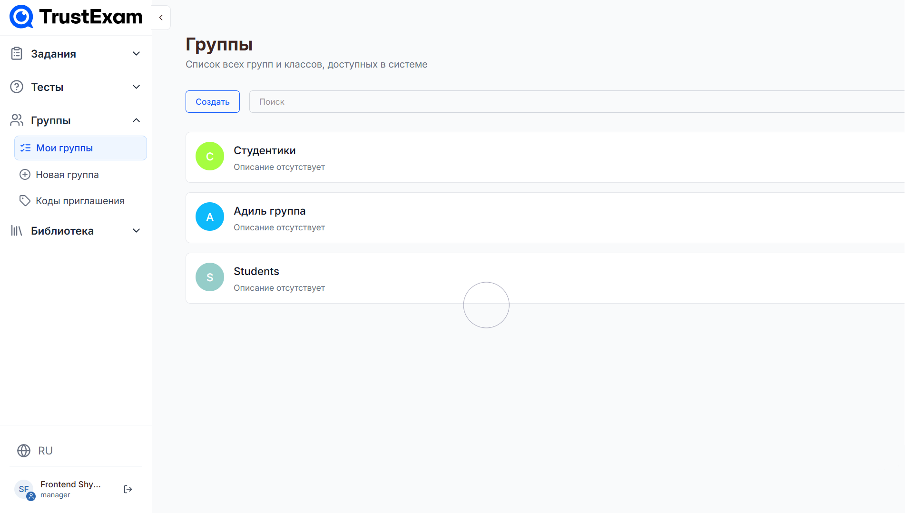
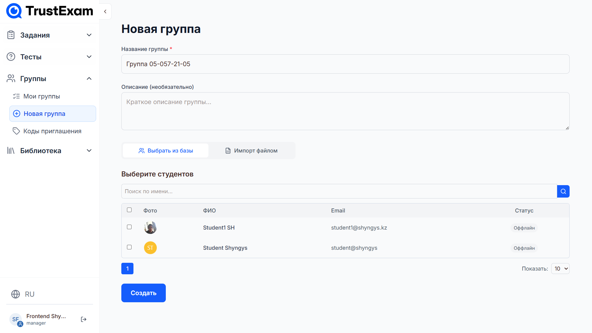

# Управление группами студентов

---

## Общее описание

Раздел **«Группы»** в системе TrustExam предназначен для управления учебными группами студентов и преподавателей. Здесь можно:

- Просматривать список всех существующих групп.
- Создавать новые группы.
- Управлять составом групп (добавлять/удалять участников).
- Генерировать и управлять пригласительными кодами для регистрации или доступа к курсам/заданиям/группам.

Доступ к этому разделу имеют пользователи с ролями: **Администратор**, **Менеджер**, **Преподаватель** (в зависимости от настроек прав).

---

## Навигация по разделу «Группы»

В левом боковом меню система предоставляет три основные подстраницы:

1. **Мои группы** — основной список всех групп, доступных пользователю.
2. **Новая группа** — форма создания новой группы.
3. **Коды приглашения** — управление пригласительными кодами.

---

## 1. Мои группы

### Описание страницы

На этой странице отображается полный список всех групп, созданных в системе или доступных текущему пользователю. Каждая группа представлена в виде карточки с иконкой, названием и описанием.

> **Скриншот: Список групп**

### Функционал

- **Поиск по группам** — строка поиска позволяет быстро находить группы по названию.
- **Создание новой группы** — кнопка `Создать` открывает форму создания новой группы (описана ниже).
- **Просмотр группы** — клик по карточке группы открывает её детальную страницу (не показана на скриншоте, но предполагается).

### Пример отображения группы

- Иконка — аватар группы (буква из названия или заданный цвет).
- Название — имя группы.
- Описание — необязательное текстовое поле, отображается под названием.

---

## 2. Новая группа

### Описание формы

Форма создания новой группы позволяет задать основные параметры и добавить участников.

> **Скриншот: Форма создания новой группы**

### Поля формы

#### 2.1. Общая информация

- **Название группы** _(обязательно)_ — уникальное имя группы (например, “Группа А-2025”).
- **Описание группы** _(необязательно)_ — текстовое поле для дополнительной информации.

#### 2.2. Участники группы

Здесь можно добавить студентов и преподавателей двумя способами:

##### A. Выбор из существующих пользователей

<!--  -->

- Поле поиска с автодополнением — позволяет найти пользователя по имени, email или ID.
- После выбора пользователь добавляется в список участников.
- Можно удалить участника из списка.

##### B. Импорт из файла

- Кнопка **“Импортировать из файла”** — загружает CSV-файл со списком студентов.
- Требования к файлу:
  - Заголовок: `email`, `first_name`, `last_name` (или только `email`).
  - Поддерживаемые форматы: `.csv`, `.xlsx`.
  - Система проверяет корректность email и дубликаты.

> Важно: При импорте система автоматически создаёт аккаунты для новых пользователей, если они ещё не зарегистрированы.

#### 2.3. Кнопки действия

- **Создать** — создаёт группу и перенаправляет на страницу созданной группы.
- **Отмена** — закрывает форму без сохранения.

---

## 3. Коды приглашения

### Описание страницы

На этой странице отображаются все сгенерированные пригласительные коды, а также предоставляется возможность создать новые.

> **Скриншот: Список кодов приглашения**

### Список кодов

Список содержит следующие поля:

| Колонка         | Описание                                                              |
| --------------- | --------------------------------------------------------------------- |
| **Название**    | Человекочитаемое имя кода (например, “Приглашение для группы А-2025”) |
| **Описание**    | Описание кода                                                         |
| **Тип доступа** | Для чего предназначен код: регистрация, курс, задание, группа         |
| **Активации**   | Сколько активаций осталось                                            |

---

### Создание нового кода приглашения

> **Скриншот: Форма создания кода приглашения (Шаг-1)**

> **Скриншот: Форма создания кода приглашения (Шаг-2)**

> **Скриншот: Форма создания кода приглашения (Шаг-3)**

#### 3.1. Общие настройки

- **Тип доступа** _(обязательно)_ — выбирается по кнопкам:
  - `Регистрация` — для регистрации нового пользователя.
  - `Курс` — для доступа к конкретному курсу (необходимо прикрепить материал).
  - `Задание` — для доступа к конкретному заданию (необходимо прикрепить материал).
  - `Группа` — для добавления в конкретную группу (необходимо прикрепить материал).
- **Название кода** _(обязательно)_ — человекочитаемое имя (не сам код!).
- **Описание** _(необязательно)_ — пояснение, зачем создан код.

#### 3.2. Ограничения

- **Лимит активаций** — максимальное число раз, которое может быть использован код (по умолчанию: 0 - `Без ограничений`).
- **Действует до** — дата и время, после которого код станет недействительным.

#### 3.3. Персональные приглашения

Если нужно отправить приглашение конкретным людям:

- Поле **Email / Номер телефона** — можно добавить несколько пользователей указав Имя и Email/Номер телефона.
- При сохранении кода система автоматически отправит приглашение на указанные контакты.

> При отправке персонального приглашения код привязывается к этим пользователям — другие не смогут его использовать.

#### 3.4. Генерация кода

- Система автоматически создаёт уникальный код на основе настроек, но при желании можно нажать кнопку **"Обновить"**, чтобы перегенерировать его.
- После генерации код отображается в поле и доступен для копирования.

---

## Дополнительные возможности

### Редактирование группы

На странице деталей группы (не показана) можно:

- Изменять название и описание.
- Добавлять/удалять участников.
- Удалять группу (с подтверждением).

### Удаление кода приглашения

- На странице списка кодов можно удалить любой код.
- Удалённый код становится недействительным и не может быть восстановлен.

### Экспорт списка групп

- В будущем планируется добавить экспорт списка групп в CSV/XLSX.

---

## Часто задаваемые вопросы (FAQ)

### Q: Можно ли изменить тип доступа кода после создания?

> Нет, тип доступа нельзя изменить. Необходимо создать новый код.

### Q: Что произойдет, если код используется больше раз, чем указано в лимите?

> Код автоматически деактивируется после достижения лимита. Последующие попытки использования будут отклонены.

### Q: Как добавить преподавателя в группу?

> При создании или редактировании группы перейдите во вкладку "Преподаватель" и добавьте доступных преподавателей из списка.

### Q: Можно ли использовать один код для нескольких групп?

> Нет. Каждый код привязан к одному конкретному ресурсу (группе, курсу и т.д.).